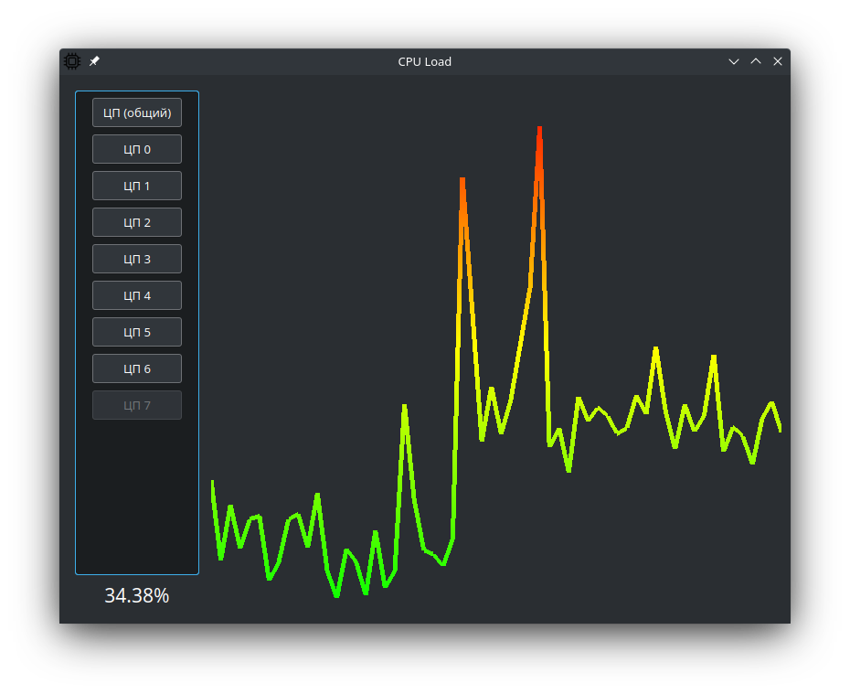

# CPU_Load

Приложение для вывода информации о загруженности CPU

## Сборка

Сборка на базе Linux:

```
mkdir build && cd build
cmake ..
make
```

Для сборки необходимы:
1. Компилятор, поддерживающий C++14
2. Библиотеки Qt 5.15 (Для Ubuntu можно воспользоваться командами `sudo apt-get install qtbase5-dev`)
3. OpenGL 3.3 

## Пример использования программы


